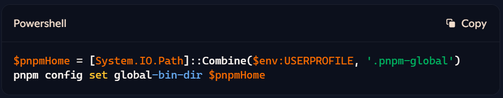
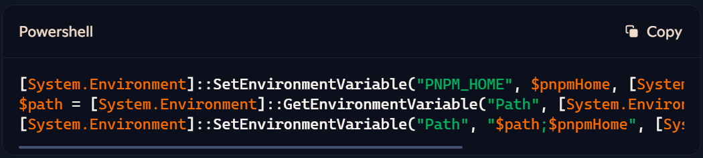
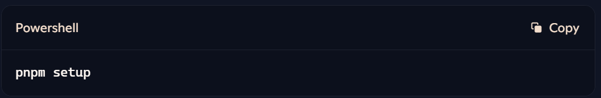
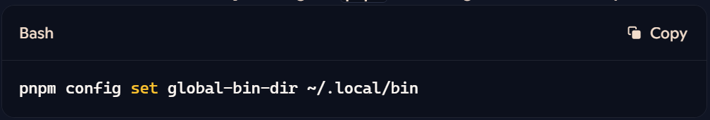
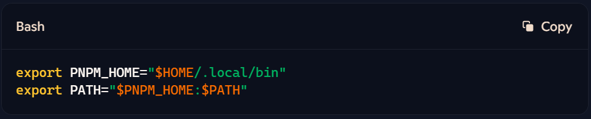
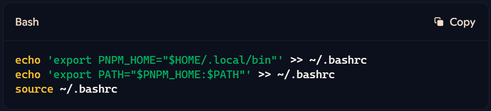
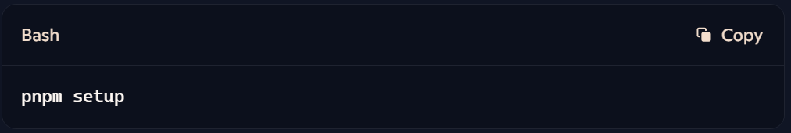
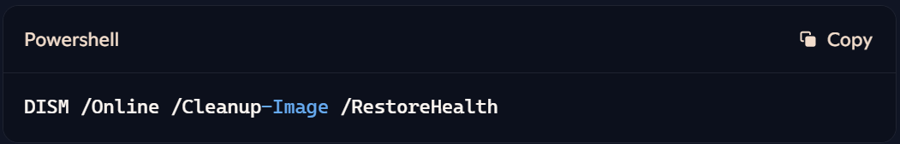
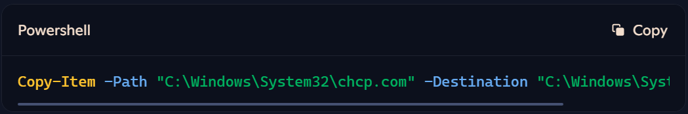
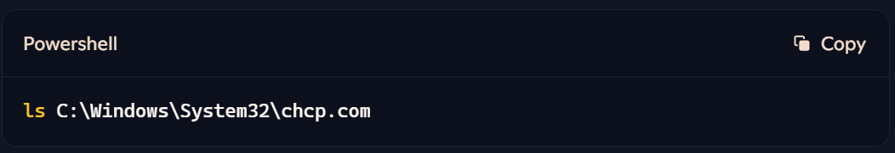

# Setup pnpm Global folder in Windows
1. 

```powershell
yarn global add pnpm
```


2. Setting Up Global Bin Directory:
To set up the global bin directory for pnpm, try running these commands in your PowerShell:

```powershell
$pnpmHome = [System.IO.Path]::Combine($env:USERPROFILE, '.pnpm-global')
pnpm config set global-bin-dir $pnpmHome
```


2. Adding Global Bin Directory to PATH:
Add the global bin directory to your PATH:
```powershell
[System.Environment]::SetEnvironmentVariable("PNPM_HOME", $pnpmHome, [System.EnvironmentVariableTarget]::User)
$path = [System.Environment]::GetEnvironmentVariable("Path", [System.EnvironmentVariableTarget]::User)
[System.Environment]::SetEnvironmentVariable("Path", "$path;$pnpmHome", [System.EnvironmentVariableTarget]::User)
```


3. Restart PowerShell:
Close and reopen PowerShell to apply the changes.

4. Run Pnpm Setup:
Now, you should be able to run pnpm setup without issues:
```powershell
pnpm setup
```


These steps should resolve the chcp and global bin directory issues. After this, you should be set to use pnpm for global installs seamlessly in your VM environment.

# Setup pnpm Global folder in Linux
1. Set the Global Bin Directory: Configure pnpm to use a global bin directory:
```powershell
pnpm config set global-bin-dir ~/.local/bin
```


2. Add the Directory to PATH: Update your PATH to include this directory:
```powershell
export PNPM_HOME="$HOME/.local/bin"
export PATH="$PNPM_HOME:$PATH"
```


3. Persist the Changes: Add these lines to your .bashrc, .zshrc, or equivalent shell config file to make the change permanent:
```powershell
echo 'export PNPM_HOME="$HOME/.local/bin"' >> ~/.bashrc
echo 'export PATH="$PNPM_HOME:$PATH"' >> ~/.bashrc
source ~/.bashrc
```


For zsh, replace ~/.bashrc with ~/.zshrc.

4. Run Pnpm Setup: Now, run the setup command to finalize the configuration:
```powershell
pnpm setup
```


These steps will set up pnpm for global use in your Linux environment, allowing you to install and manage global packages seamlessly.
Happy coding! 🐧✨

# Trouble-Shooting

## Check if chcp.com exists in C:\Windows\System32 and path is in environment variable

### 1. Check if chcp.com exists in C:\Windows\System32

```powershell
ls C:\Windows\System32\chcp.com
```

### 1.1. If it exists, check current session Process-Level Path environment if it has C:\Windows\System32

```powershell
$processPath = $env:Path -split ';' | ForEach-Object { $_.Trim() } | Where-Object { $_ -eq 'C:\Windows\System32' }
$processPath
```

### 1.1.1. If path C:\Windows\System32 is not found, check first if it exists in the User-Level variable

```powershell
$userPath = [System.Environment]::GetEnvironmentVariable("Path", [System.EnvironmentVariableTarget]::User)
```

### 1.1.1.1 If it does not exist, add it to the User and Process level environment variable Path

```powershell
[System.Environment]::SetEnvironmentVariable("Path", "$userPath;C:\Windows\System32", [System.EnvironmentVariableTarget]::User)

$env:Path = $userPath
```

### 1.1.1.2 If it exists in the User level variable, just add it to the Process level environment variable Path

```powershell
$env:Path = $userPath
```
Note: If you open a new terminal in VS you got to repeat from 1.1.1. again but if you open a new VS Code IDE, you wouldn't have to.

### 1.2. If chcp.com does not exists, reinstall it
### 1.2.1. Repair Windows Image using DISM

```powershell
DISM /Online /Cleanup-Image /RestoreHealth
```



### 1.2.2. Restart the computer and check again
### 1.3. Manually Restore chcp.com (if still missing)
### 1.3.1. Copy chcp.com from another working Windows machine:

```powershell
Copy-Item -Path "C:\Windows\System32\chcp.com" -Destination "C:\Windows\System32\chcp.com"

```


### 1.3.2. Verify it is now accessible

```powershell
ls C:\Windows\System32\chcp.com
```




This should ensure you’ve got everything detailed and clear for troubleshooting! 🎀✨